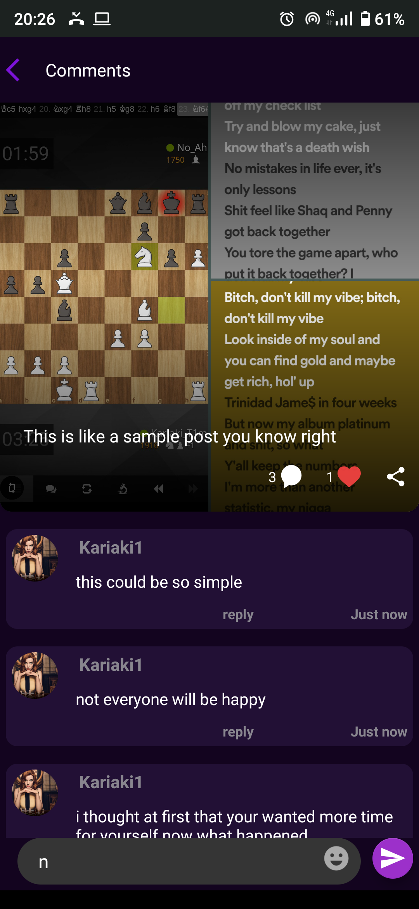
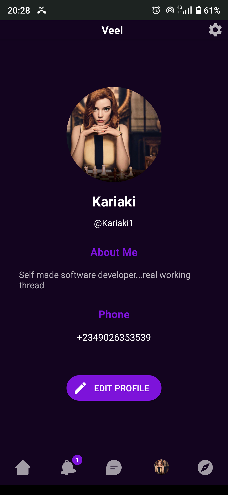
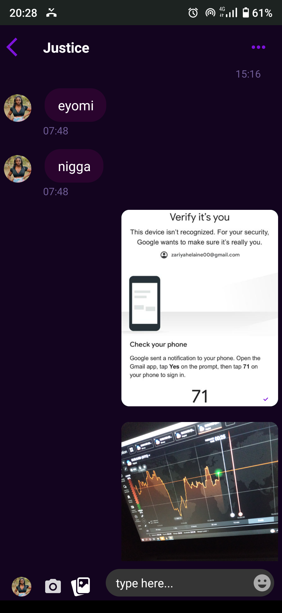
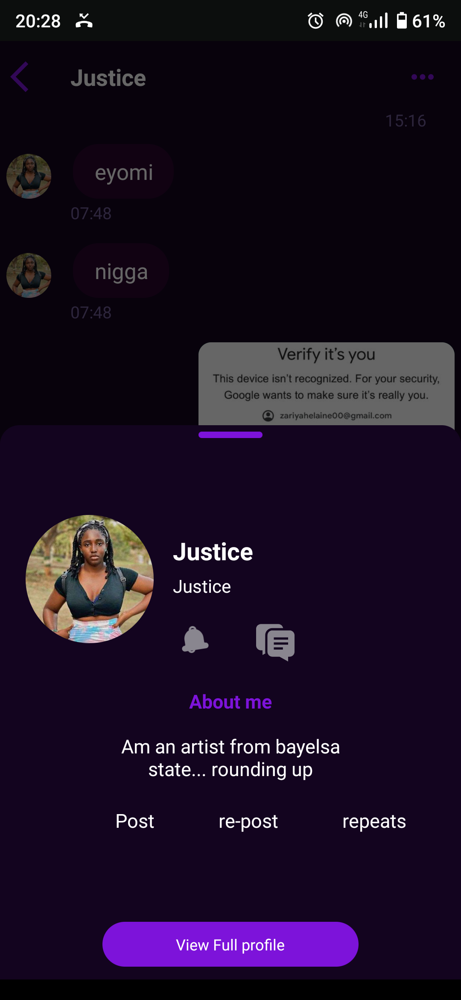
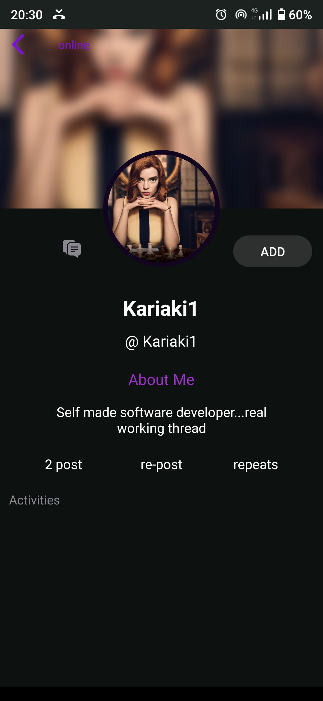

# Choice

# Choice

# Choice Social media

It is a social media like instagram and also like a messanger (whatsapp). It basically uses the messaging contact system to replace 
the social media "follow/friend" system. Therefore you chat with your contacts like a messanger, while you also enjoy social experience
from post contents and comments from your contacts and contacts of your contacts (the chain continue). Choice allows users to create groupchats, pages
and snap posts.

# Features include

    1. snap post : post that deletes after 24hrs by default and stays longer as long as users are interacting with it via views,comments,likes and shares.
    
    2. Voice note comments
    
    3. clouds : this is a way to make an account go public and attract audience. By default every account is private and cannot attract audience by being followed.
    
    4. Repeat post : this is a way to make shared content gets viral, therefore a post will automatically be reposted if its set on repeat and its viewed, commented on or liked by a certain use

Choice is remains my favorite project and it was developed using firebase (ML, firestore, cloud messaging ) , Java and many other third party libraries.

# Screenshots

